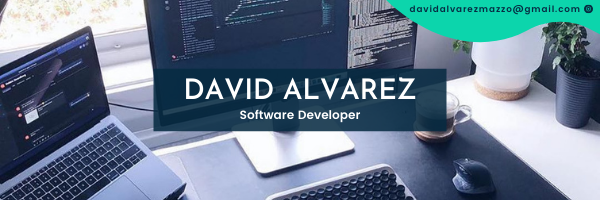

# David Alvarez's personal README

## 🌱 Who am I? 
-  I'm a beginner programmer eager to generate solutions and create a nice user experience
-  I’m currently working on developing and designing a website for an HVCA company
-  Currently a Microverse student
-  I worked as a mechanical engineer for four years, where I designed and developed an application that helped to save 25% of the time in company processes
-  Videogames enthusiast
-  Geek

## 📫 Links:
- My Linkedin: [David Alvarez](https://www.linkedin.com/in/david-alvarez-mazzo-777712143/)
- My Twitter: [@petudeveloper](https://twitter.com/petudeveloper)
- My Instagram: [@petumazo](https://www.instagram.com/petumazo/)
- E-mail me at davidalvarezmazzo@gmail.com
 
## 🔭 My stack:
- HTML
- CSS
- Ruby
- Ruby on Rails
- JavaScript
